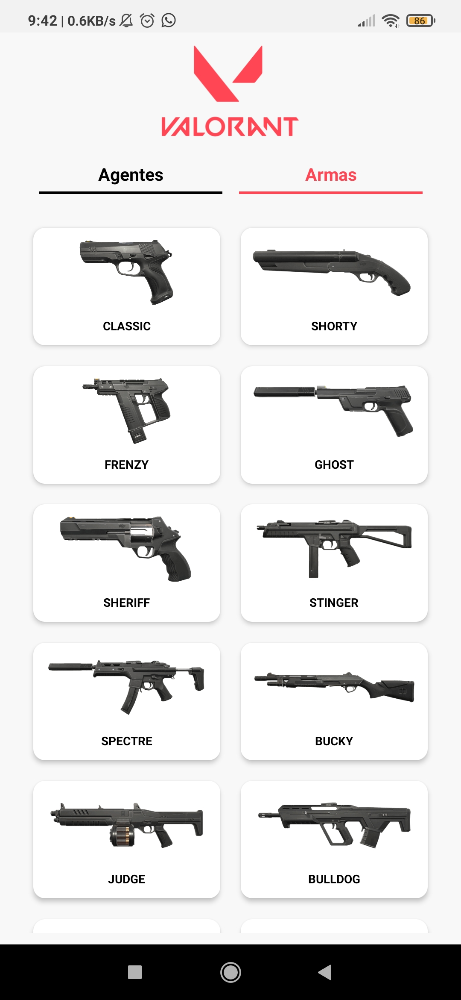
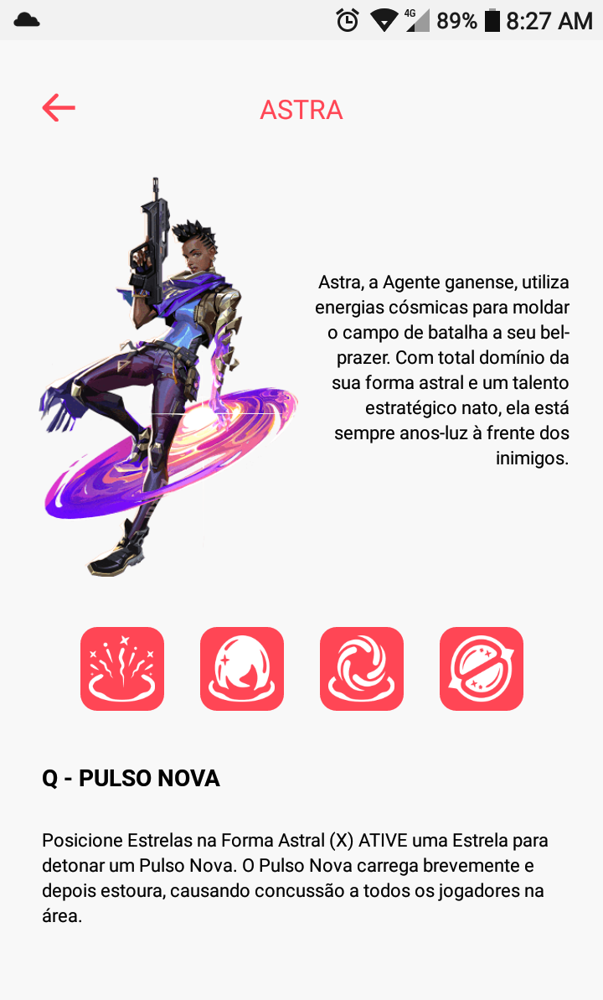
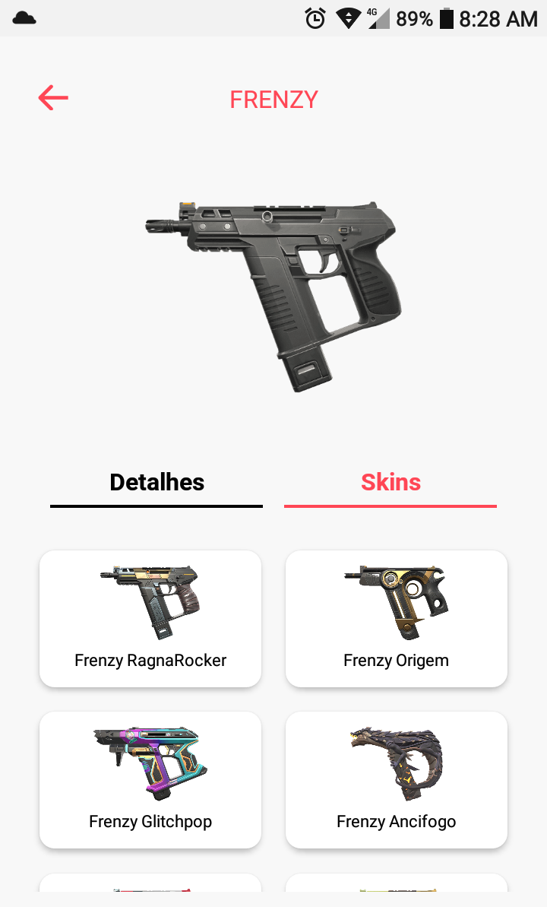

# Valorant-Guide

## App mobile, contém informações sobre o jogo Valorant

<!--ts-->
   * [Sobre](#sobre)
   * [Tecnologias](#tecnologias)
   * [Instalação](#instalacao)
<!--te-->
    
<h4 align="center" id="sobre">
    O projeto se trata de um app que fornece informações sobre o jogo FPS Valorant, desde agentes, armas e skins.
</h4>

<h1 style="display:flex; flex-direction:row" align="center">
   
   
</h1>

<h1 align="center" style="display:inline-block">
   
   
</h1>

<h3 id="tecnologias"> 🛠 Tecnologias</h3>

As seguintes ferramentas foram usadas na construção do projeto:

- [Typescript](https://www.typescriptlang.org/)
- [React Native](https://reactnative.dev/)
- [Valorant API](https://valorant-api.com/)

<h3 id="instalacao"> Pré-requisitos</h3>

Antes de começar, você vai precisar ter instalado em sua máquina as seguintes ferramentas:
[Git](https://git-scm.com). 
[Node](https://nodejs.org/en/).
[Expo](https://expo.dev/).
Além disto é bom ter um editor para trabalhar com o código como [VSCode](https://code.visualstudio.com/)

### 🎲 Rodando a aplicação

```bash
# Clone este repositório
$ git clone <https://github.com/brunoeco/valorant-guide>

# Acesse a pasta do projeto no terminal/cmd
$ cd valorant-guide

# Agora, basta instalar as dependências e emular o expo, baixe o app do expo no celular
$ npm install
$ expo start

```

### Acesse meu portifólio: https://brunoeco.github.io/portfolio/
